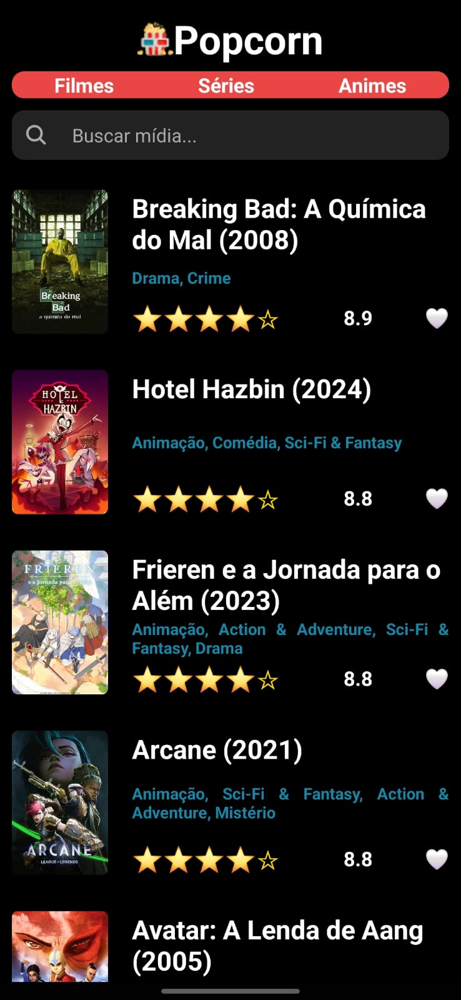
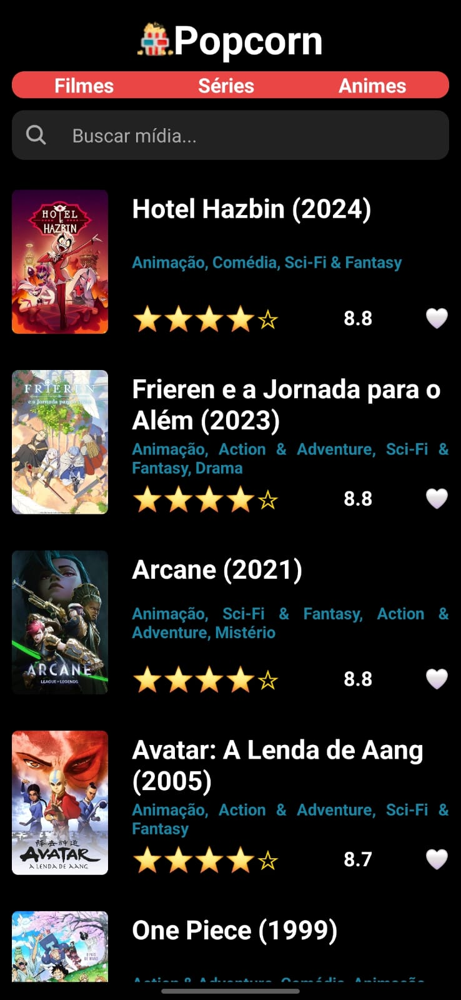

# Popcorn - Aplicativo de Filmes, Séries e Animes

O Popcorn é um aplicativo mobile desenvolvido com React Native que exibe os filmes, séries e animes mais bem avaliados. Ele foi criado como parte da avaliação da disciplina de Desenvolvimento Mobile do curso técnico da ETEC de Guarulhos, no 2º módulo.

## Screenshots





## Funcionalidades

1. **Filmes, Séries e Animes Bem Avaliados:** Descubra os títulos mais bem avaliados em diferentes categorias.
2. **Pesquisa de Títulos:** Encontre rapidamente filmes, séries e animes através da funcionalidade de pesquisa.
3. **Design Intuitivo:**  Interface simples e acessível para facilitar a navegação entre filmes, séries e animes.
4. **Detalhes sobre Títulos:**  Veja informações detalhadas sobre cada título, como sinopse, elenco e avaliação.
## Tecnologias Utilizadas

- **React Native:** Framework para construção de aplicativos móveis.
- **Expo:** Ferramenta para desenvolvimento rápido de aplicativos React Native.
- **API TMDN::**  Fonte de dados para filmes, séries e animes.

## Pré-requisitos

Antes de instalar, certifique-se de que você tem os seguintes pré-requisitos:

- **Node.js:** Versão 14 ou superior instalada em seu sistema.
- **Expo Go:** O aplicativo Expo Go deve estar instalado em seu dispositivo Android **ou** você pode usar o **Android Studio** para emular o aplicativo.

## Como Instalar

1. Clone o repositório:
    ```bash
    git clone https://github.com/mvsilvass/react-native-popcorn
    ```
2. Navegue até o diretório do projeto:
    ```bash
    cd react-native-popcorn
    ```
3. Crie o arquivo .env a partir do exemplo:
    ```bash
    cp .env.example .env
    ```
4. Abra o arquivo .env e substitua your_api_key_here pela sua chave da API TMDN:
    ```bash
    REACT_APP_API_KEY=your_api_key_here
    ```
    **Por questões de segurança, você precisa configurar sua própria chave da API para testar este aplicativo.** Você pode obter sua chave de API na [página de registro da API TMDN](https://www.themoviedb.org/settings/api). 
5. Instale as dependências:
    ```bash
    npm install
    ```
6. Inicie o projeto:
    ```bash
    npx expo start
    ```
7. Abra o aplicativo no seu dispositivo ou em um emulador:

   - Se estiver com seu Android em mãos, com o aplicativo Expo Go, escaneie o código QR que aparece no terminal.
   - Se estiver usando um emulador, você pode selecionar a opção Android correspondente para iniciar o aplicativo no emulador.

## Licença

Este projeto está licenciado sob a [MIT License](LICENSE). Veja o arquivo [LICENSE](LICENSE) para mais detalhes.
